# Sentiment-Analysis
## Introduction
Text mining procedures are getting more and more popular thanks to the increasing relevance of unstructured data such as textual information. One of the studies that can be carried out using this information is the Sentiment Analysis, that in short associates a certain polarity (positive, neutral or negative) to chunks of text. One of the fundamental aspects is the choice of the dictionary that associates the corresponding polarity to each term. The purpose of this study is to verify if using different dictionaries we obtain results that are consistent with each other or produce different results. If convergence is not achieved, one can also evaluate which dictionary produces the most accurate results. The choice of the Italian language reduces the number of dictionaries available, but in any case 4 have been identified and their characteristics will be specified later.

## Chapter 1: Polarity Assignment Based on Different Dictionaries
### 1.1 Downloading, cleaning and pre-processing data
For this study among the many social networks available I decided to use Twitter because it allows you to easily identify comments for a given topic. At the basis of obtaining information on Twitter, there was a web scraping activity, or data extraction, which was possible through the API (Application Programming Interfaces). The data of our interest are represented by the tweets (public by definition) of users. In total 4957 tweets were downloaded:

- 994 were identified as containing the word "Italia"
- 981 were identified as containing the word "Salvini"
- 987 were identified as containing the word "Fiorentina"
- 997 were identified as containing the word "Macron"
- 998 were identified as containing the word "suicidio"

At this point it is necessary to proceed with a phase of cleaning and pretreatment of data, in order to eliminate all those components of the tweet that are useless for the analysis. This process is performed individually for each of the 5 topics described above. We proceed to eliminate:
- All punctuation marks, numbers and words consisting of less than three letters
- All double spaces repeated
- Words marked with # and @
This can be achieved through a single command using the CleanTweets function. At this point a Term-Document-Matrix has been created using the doWrdCld function and it indicates the frequency of a certain word in each document (in this case tweet). This also allows you to create a cloud of the most frequent words, the greater the size of the word in the graph, the more the word will be repeated within the tweets. 

### 1.2 Dictionaries used
At this point, we can proceed with assigning the polarity to each tweet through the myClassPolarity function. Based on the Bayesian classifier, the tweet is associated to a positive, neutral or negative polarity. The allocation of polarity to each term is guaranteed by various dictionaries that can be downloaded for free on the net. For my study 4 dictionaries were used:

1. SENTIX

It combines each term with its grammatical category (noun, verb, adjective, adverb), an ID, a negativity score and a positivity score, a polarity and an intensity. The sum of the scores of positivity (p), negativity (n) and neutrality must be equal to 1, however there are no restrictions on the size of p and n. The term can therefore be represented on a Cartesian plane, where on the abscissa we have p and on the ordinate n. Since the sum must be 1 the plane is restricted to a triangle.

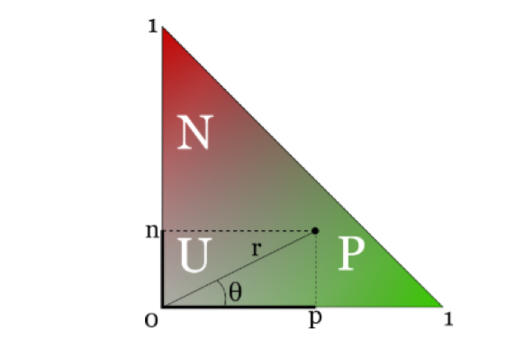

      
Terms that fall into the region O are positive, those that fall into N are negative and those that end up in U are neutral. However, the regions are not clearly delineated.

2. DISTRIBUTIONAL POLARITY LEXICON

Conceptually it is very similar to the dictionary described above, each lemma is associated with a score for positivity, negativity and neutrality and the sum of these must be 1. The classifier that was used to assign these polarities was trained using data from social media .

3. ItalWordNet

It combines each term with the respective polarity (positive, negative and neutral). This classification was carried out for 49,350 terms. It is based on the intersection of the EuroWordNet and SI-TAL (Integrated System for Automatic Language Processing) project.

4. SUBJECTIVITY LEXICON

This one, as the previous dictionary, associates a positive, negative or neutral polarity to 4,912 terms. 

To make the results comparable, the first two dictionaries had to be modified, because they give a quantitative interpretation of polarity, instead a qualitative interpretation is required for all the dictionaries, that is, associating each lemma with a positive, negative or neutral value. To do this, I defined a new variable (score) given by the sum of the scores of positivity and negativity, the latter was made negative by multiplying it by "-1". At this point another variable has been defined and takes the value:

1. "Positivo": if score assumes a value greater than 0.4
2. "Negativo": if score assumes a value less than or equal to -0.4
3. "Neutrale": if score assumes a value between -0.4 and 0.4.

The thresholds were chosen so that the proportions of positive, negative and neutral terms represented those of the ItalwordNet dictionary.

### 1.3 Polarity Assignment

Now it is possible to associate to each tweet its polarity using the MyClassPolarity function. Specifying "bayes" as algorithm, tweets that have a ratio of positive and negative terms, that it is greater than 1, are classified as positive, those with a ratio lower than 1 as negative and those with a ratio equal to 1 (or where positive and negative terms do not appear) as neutral. The results have been reported below.

 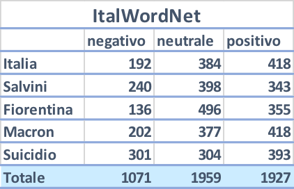
 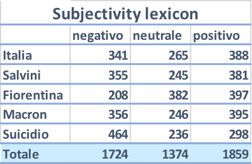
 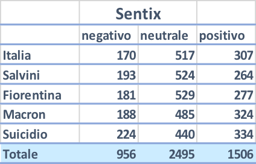 
 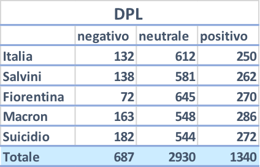     

In order to have a more readable result, I reported the pie charts with the percentages of positive, negative and neutral tweets with respect to the 4 analyzes using the totals, hence the last rows of the table.

 
 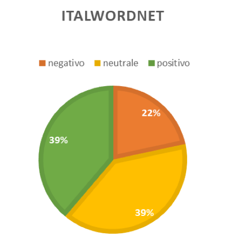
 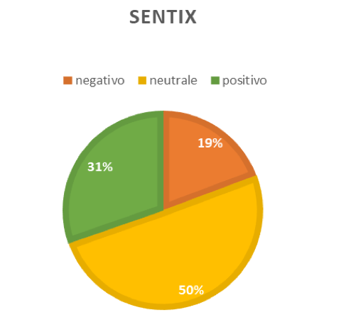 
 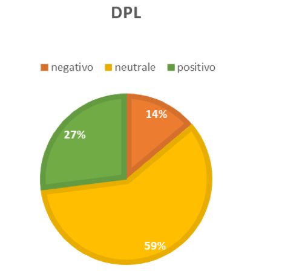     

### 1.4 Results Overview

As we can see, the outcomes produced by Sentix and DPL are quite similar to each other. The work done with Sentix is also similar to the one done with ItalWordNet, in particular regarding the percentage of negative tweets. The analysis made with the Subjetivity Lexicon instead, differs from all the others, only the percentage of positive tweets is similar to the one of ItalWordNet and Sentix. The Subjetivity Lexicon dictionary  distributes tweets between the different polarities in a excessively democratic way, perhaps underestimating the presence of a fair portion of tweets that are neutral. This dictionary is therefore the most sensitive to positive and negative elements, nevertheless it is difficult to say whether it is a good or a bad thing according to this results. The Distributional Polarity Lexicon on the other hand has the opposite behavior, assigning a large number of tweets to neutral class. Sentix and ItalWordNet seem to represent a compromise between the two.

To understand the origin of this discrepancies, I built 4 word clouds for each dictionary using the 981 tweets containing the word Salvini. This graphs show the terms with the highest frequency within each class (positive, negative and neutral). Wordclouds of this type can be created using the comparison.cloud function.

 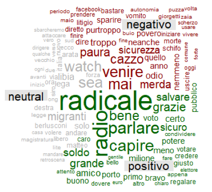
 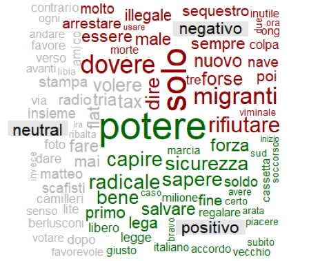
 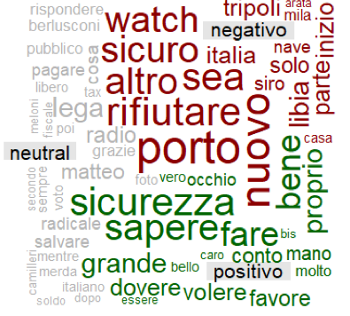 
 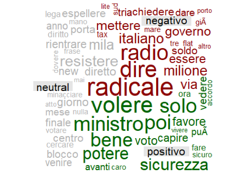     

As we can see there are significant differences between the word clouds, very few terms appear in more than one cloud and if this happens, sometimes they belong to different classes. The most striking example is the one of the term "radicale", that in the graph related to the analysis done with Subjectivity Lexicon is classified as negative, but in the ones done with Distributional Polarity Lexicon and Sentix is classified as positive. Other terms also follow a different classification such as "migranti", "sicurezza", "soldo" and so on. These differences had an important role in producing discrepancies in the classifications of the tweets, given that these terms are the most frequent ones.

## Chapter 2: Evaluation of the dictionaries used

The studies carried out so far reveal what are the differences in the polarity classification using the different dictionaries, but we can still say nothing about which one produces the best result, in terms of consistency with respect to the true polarity of the document. To proceed in this direction, we use data from the e-commerce company Amazon. In this case, the choice fell on Amazon because each textual review of the products promoted on its site, is paired with a score ranging from 1 to 5 stars, the latter should reflect and summarize the written review. It is therefore reasonable to think that a high score assigned to the product is followed by a comment with positive polarity, so the quality of the dictionary can be evaluated using the idea of checking if to a certain score (in terms of stars) corresponds a coherent classification by the algorithm (in terms of polarity).

The web scraping step in this case was not carried out through the use of an API, but rather through the rvest library, which allows to read different elements of a web page. Through a function created by Riki Saito it was possible to download comments and scores related to 3 products:
- Nespresso Inissia XN1001 Espresso Machine
- Xiaomi Mi Band 3
- Samsung MB-MC32GA / EU EVO Plus 32GB MicroSD card

At this point I proceeded in a similar way for what I did before with the tweets, cleaning and lemmatizing the reviews. The polarity was then assigned using the 4 dictionaries and thus obtaining 4 different results. To make a proper comparison the scores (stars) have been transformed into a qualitative variable that takes the value:
1. Positive: if the score is greater than 3.5
2. Neutral: if the score is between 2.5 and 3.5
3. Negative: if the score is less than 2.5
For each review we obtained an estimated polarity thanks to the sentiment analysis, as well as an expected one resulting from the scores related to the product and made by the same author of the review. Now to avoid having too many reviews of the same type, the same number of reviews has been considered for each negative, neutral and positive polarity. The result of this is that for:
1. Nespresso Inissia XN1001 Espresso Machine 429 reviews were considered, 143 for each polarity
2. Xiaomi Mi Band 3 609 reviews were considerd, 203 for each polarity
3. Samsung MB-MC32GA / EU EVO Plus 32 GB MicroSD card 252 reviews, 84 for each polarity

By aggregating the data from the 3 sources a total of 1290 reviews were considered in order to make a comparisons between the 4 dictionaries using the following statistics:

- Accuratezza (Accuracy): indicates the proportion of correctly classified records
- ErrataSpec (Misclassification rate): Indicates the proportion of misclassified records
- PrecisionePos: indicates the proportion of correctly classified positive reviews out of the total of those classified as such.
- PrecisioneNeg: indicates the proportion of correctly classified negative reviews out of the total of those classified as such.
- PrecisioneNeu: indicates the proportion of correctly classified neutral reviews out of the total of those classified as such.

Below the table with the results is reported.

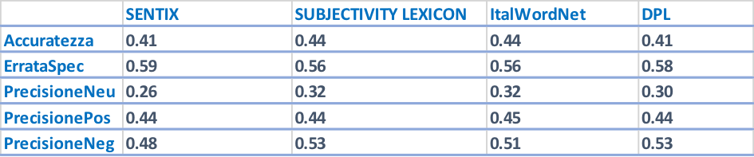

As we can see in this case the results suggest a convergence between the different analyzes, only those carried out with the DPL and Sentix seem to produce less accurate classifications. Between 41-44% of cases were assigned correctly, the most accurately assigned reviews were the negative ones, followed by the positive and neutral ones. We can say that the analyzes carried out with ItalWordNet and Subjectivity Lexicon have produced better results, perhaps because the transformation of the information contained in Sentix and DPL, from quantitative to qualitative, has distorted their characteristics, certainly leading to a loss of information.

## Final Considerations

The results show differences in the polarity classification based on the different dictionaries. Obviously the extent of the discrepancies depends on who are the subjects of the comparison, in fact Sentix and DPL are similar to each other and the same thing applies for ItalWordNet and Subjectivity Lexicon. The differences regarding the prediction quality are less evident, the results however favor the approach with some dictionaries, but we can't make a clear preference out of it. Surely the study can be improved from different points of view, starting from the amount of data collected and their variety both in terms of source (Twitter, Facebook, Amazon) and context (politics, electronics). This addition would certainly lead to greater extensibility of the results obtained, but also to greater reliability. Another critical point concerns the transformation of the information from quantitative to qualitative. This has led to a loss of information, but also to a potentially inaccurate classification.

